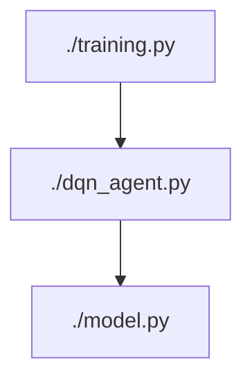

# Udacity Deep Reinforcement Learning - Navigation (Project 1)
## Introduction

In this project, the goal is to teach an agent collect yellow bananas and avoid blue bananas in a 3D Unity environment. The agent has access to the environment's 37 dimensional state, which consists of the agent's velocity as well as "ray-based perception of objects around the agent's forward direction". Each of these 37 dimensional states takes on a continuous value. From this state, the agent learns which of four descrete actions it should take. The actions are as follows:
>  0 - Move forward  
>  1 - Move backward  
>  2 - Turn left  
>  3 - Turn right

When interacting with the environment during a single run or episode, the agent will recieve a reward of +1 when collecting a yellow banana and a reward of -1 when collecting a blue banana. The agent is thought to have solved or learned the environment when the agent gets an average score of +13 over 100 consecutive episodes.

---
### Requirements:
To replicate this results of this project you need to create a conda environment using python 3.6 and activate it. This can be done as follows for Linux or Mac. (For windows, follow Udacity's [instructions](https://github.com/udacity/deep-reinforcement-learning#dependencies))

>  ```console
>  $ conda create --name drlnd python=3.6
>  $ source activate drlnd
>  (drlnd) $
>  ```

Then in your environment, install OpenAI's gym as follows:
> ```console
> (drlnd) $ git clone https://github.com/openai/gym.git
> (drlnd) $ cd gym
> (drlnd) $ pip install -e .
> ```

After installing gym, you must install Udacity's required python packages as follows:
> ```console
> (drlnd) $ git clone https://github.com/udacity/deep-reinforcement-learning.git
> (drlnd) $ cd deep-reinforcement-learning/python
> (drlnd) $ pip install .
> ```

Then you create a Jupiter notebook kernel that can run the Unity environment provided by Udacity  as follows:
> ```console
> (drlnd) $ python -m ipykernel install --user --name droned --display-name "drlnd"
> ```

When running in the Jupiter notebook you can start your your notebook kernel as shown below.


Next you will download the rebuild Unity Environment at one of these links:

> Linux: [Single Agent](https://s3-us-west-1.amazonaws.com/udacity-drlnd/P1/Banana/Banana_Linux.zip)
> Linux: [No Visualization - Single Agent](https://s3-us-west-1.amazonaws.com/udacity-drlnd/P1/Banana/Banana_Linux_NoVis.zip)
> Mac: [Single Agent](https://s3-us-west-1.amazonaws.com/udacity-drlnd/P1/Banana/Banana.app.zip)

You can then explore the environment by going to the *Udacity DRLND GitHub* ([here](https://github.com/udacity/deep-reinforcement-learning)) repository and open the *Navigation.ipynb* file in the *p1_navigation* folder ([here](https://github.com/udacity/deep-reinforcement-learning/tree/master/p1_navigation)).

## Training
### Single Agent Training
To train, in your terminal run the following:
> ```console
> (drlnd) $ python3 ./training.py
> ```



This will run a Deep Q-Network with the following default hyper parameters:
>```console
> (drlnd) $ python3 ./training.py \
> --n_episodes 2000 \
> --max_t 2000 \
> --eps_start 1.0 \
> --eps_end 0.01 \
> --eps_decay 0.9 \
> --BUFFER_SIZE 1e5 \
> --BATCH_SIZE 64 \
> --GAMMA 0.99 \
> --TAU 1e-3 \
> --LR 5e-4 \
> --UPDATE_EVERY 4 \
> --state_size 37 \
> --seed 42 \
> --model_num 8 \
> --num_units 64
> ```

### Multiple Model Training (not in parallel, Unity will crash)

To train multiple agents (and have it run in the background, in your terminal run the following:
> ```console
> (drlnd) $ nohup python3 MultiModel.py &
> ```

You can edit the loops inside MultiModel.py to control what hyper-parameters you train with. 
