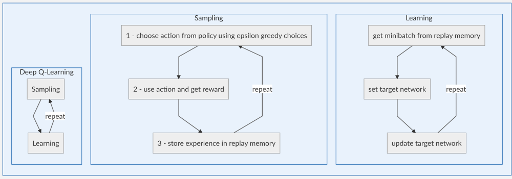
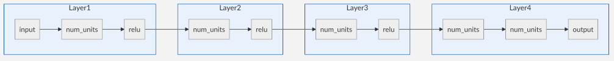
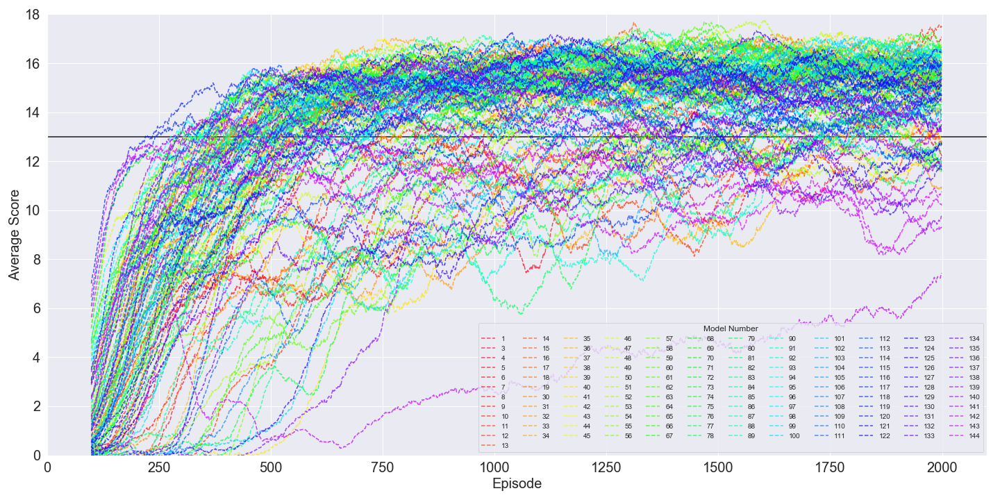
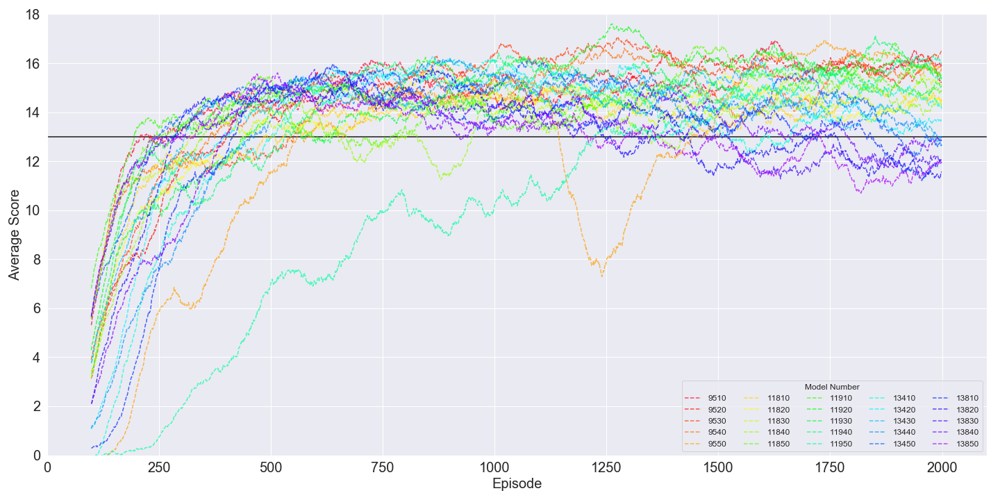

# Navigation (Project 1) - Report

To solve this environment, I started with the Deep Q-Network that was shown earlier in this section of the class. 

As with any Reinforcement Learning problem, it can be boiled down to:
As an Agent in a State, what action do I take to maximize the Reward the Environment will give me.

This method uses a neural network to approximate a Q-Table as a way of giving the Agent a policy for selecting Actions in hopes of maximizing its received Rewards. A Q-Table is a table which holds the expected reward (r) for taking a specific action (a) in a specific state (s). The goal of using a Q-Table is to find the best actions to take in each state by exploring different states and actions and updating what reward was received in the Q-Table.

There are many ways to update the Q-Table, the most popular starting point being the Bellman Equation.  

The Q-Table update can be formulated as: 
Q(s,a) <--- r + gamma(max(Q(s',a')))

When first starting training, the Q-Table is empty and requires filling. This is done by using a epsilon-Greedy style of action selection. This entails assigning an unchanging value of 0 <epsilon < 1 and generating a random number where if that random number is less than epsilon, a random action is taken and if that number is greater than epsilon, the action in the Q-Table for that state where the reward is the largest is taken. Early on, there are many states and actions to explore so in the beginning of training many random actions are taken with their rewards stored in the form of experience tuples containing (state, action, reward, next_state, done_or_not) in what is called a replay buffer. This replay buffer is a double ended qeque of a fixed size that allows the memory to change over time. Once the size of the buffer is large enough, learning can begin by updating the Q-Table. 

There are some problems for this way of training our Agent, specifically, our states are continuous values making our Q-Table have basically infin values. This is where our Q-Network will come in as a way to approximate the Q-Table instead of having a discrete table as shown above.

Another more subtle issue that is run into is that if we update our Q-Network every chance we get, it has the potential to become very unstable. To mitigate this problem, we will actually use two neural networks, although in the end we only care about one. The networks are our main Q-Network and our target Q-Network. This target network is held static for a fixed number of training steps while training the main network as the goal of what the main network should be working towards. When the target network is updated, it is pushed towards the main network but does not get replaced completely by the main network. This makes things run much more smoothly. 

The over all Deep Q-Learning algorithm can be broken in to two steps:

# Results
I ran many experiments with different hyper parameters. The ones I chose to vary were  the learning rate (GAMMA), how often the target network is updated (UPDATE_EVERY), and the number of number of units in each fully connected layer of the neural network (num_units)

GAMMA takes on values = [0.95, 0.96, 0.97, 0.98, 0.99, 1.00]
UPDATE_EVERY takes on values = [1, 2, 3, 4, 5, 6]
num_units takes on values = [8, 16, 32, 64]

All other hyper parameters were the defaults set by training.py (also shown in README.md)

This gives 6 (GAMMA) * 6 (UPDATE_EVERY) * 4 (num_units) = 144 total models trained.

The neural network architecture is as follows:

The variable num_units is the same for each of the layers shown above.

The results are shown below (the horizontal black line is the value required to be considered solved):

After this grid search for hyper parameters, I took the 5 best models (models 119, 118, 95, 138, 134) and re-trained using new starting seeds for initialization. I trained 5 new seeds (10, 20, 30, 40, 50) to find which model performs best.

These results of these 25 newly trained models are shown below where the model number is the original model number with the seed appended to the end of the value.

These 5 models statistics are shown below.

| model | mean  | std    | min   | 25%   | 50%   | 75%   | max    |
|-------|-------|--------|-------|-------|-------|-------|--------|
| 138   | 319.8 | 78.82  | 241.0 | 266.0 | 284.0 | 392.0 | 416.0  |
| 118   | 365.6 | 97.63  | 240.0 | 317.0 | 347.0 | 439.0 | 485.0  |
| 134   | 382.2 | 103.36 | 250.0 | 308.0 | 396.0 | 456.0 | 501.0  |
| 95    | 416.6 | 145.66 | 208.0 | 364.0 | 401.0 | 551.0 | 559.0  |
| 119   | 535.4 | 407.01 | 195.0 | 282.0 | 444.0 | 532.0 | 1224.0 |

It can be seen that model 138 turned out to be the best model even though it came in fourth in the initial grid search for the best hyper parameters!
With GAMMA = 1.00, UPDATE_EVERY = 2, num_units = 32.

The results for all-models and the seed-models are shown (sorted by win_iter) in the tables in the Appendix - A and Appendix - B respectively.

The best models can be found [here](https://github.com/nickvazz/Udacity-DRL/tree/master/Section2/best-models).

# Appendix - A (All-Model Results)
| model     | GAMMA | UPDATE_EVERY | num_units | win_iter |
|-----------|-------|--------------|-----------|----------|
| model-119 | 0.99  | 1            | 16        | 220.0    |
| model-118 | 0.99  | 1            | 32        | 242.0    |
| model-95  | 0.98  | 1            | 16        | 277.0    |
| model-138 | 1.0   | 2            | 32        | 283.0    |
| model-134 | 1.0   | 3            | 32        | 290.0    |
| model-67  | 0.97  | 2            | 16        | 292.0    |
| model-70  | 0.97  | 1            | 32        | 292.0    |
| model-23  | 0.95  | 1            | 16        | 298.0    |
| model-94  | 0.98  | 1            | 32        | 304.0    |
| model-47  | 0.96  | 1            | 16        | 306.0    |
| model-143 | 1.0   | 1            | 16        | 309.0    |
| model-115 | 0.99  | 2            | 16        | 315.0    |
| model-46  | 0.96  | 1            | 32        | 316.0    |
| model-22  | 0.95  | 1            | 32        | 319.0    |
| model-85  | 0.98  | 3            | 64        | 331.0    |
| model-90  | 0.98  | 2            | 32        | 335.0    |
| model-114 | 0.99  | 2            | 32        | 335.0    |
| model-38  | 0.96  | 3            | 32        | 344.0    |
| model-109 | 0.99  | 3            | 64        | 353.0    |
| model-71  | 0.97  | 1            | 16        | 357.0    |
| model-133 | 1.0   | 3            | 64        | 360.0    |
| model-111 | 0.99  | 3            | 16        | 361.0    |
| model-42  | 0.96  | 2            | 32        | 365.0    |
| model-37  | 0.96  | 3            | 64        | 366.0    |
| model-62  | 0.97  | 3            | 32        | 370.0    |
| model-15  | 0.95  | 3            | 16        | 377.0    |
| model-66  | 0.97  | 2            | 32        | 377.0    |
| model-58  | 0.97  | 4            | 32        | 379.0    |
| model-139 | 1.0   | 2            | 16        | 387.0    |
| model-17  | 0.95  | 2            | 64        | 395.0    |
| model-106 | 0.99  | 4            | 32        | 398.0    |
| model-13  | 0.95  | 3            | 64        | 400.0    |
| model-82  | 0.98  | 4            | 32        | 403.0    |
| model-61  | 0.97  | 3            | 64        | 406.0    |
| model-18  | 0.95  | 2            | 32        | 408.0    |
| model-54  | 0.97  | 5            | 32        | 409.0    |
| model-19  | 0.95  | 2            | 16        | 414.0    |
| model-101 | 0.99  | 5            | 64        | 418.0    |
| model-130 | 1.0   | 4            | 32        | 423.0    |
| model-65  | 0.97  | 2            | 64        | 424.0    |
| model-129 | 1.0   | 4            | 64        | 428.0    |
| model-81  | 0.98  | 4            | 64        | 429.0    |
| model-137 | 1.0   | 2            | 64        | 430.0    |
| model-41  | 0.96  | 2            | 64        | 431.0    |
| model-91  | 0.98  | 2            | 16        | 431.0    |
| model-14  | 0.95  | 3            | 32        | 436.0    |
| model-113 | 0.99  | 2            | 64        | 437.0    |
| model-9   | 0.95  | 4            | 64        | 441.0    |
| model-53  | 0.97  | 5            | 64        | 442.0    |
| model-45  | 0.96  | 1            | 64        | 443.0    |
| model-86  | 0.98  | 3            | 32        | 449.0    |
| model-83  | 0.98  | 4            | 16        | 454.0    |
| model-89  | 0.98  | 2            | 64        | 461.0    |
| model-125 | 1.0   | 5            | 64        | 461.0    |
| model-87  | 0.98  | 3            | 16        | 464.0    |
| model-105 | 0.99  | 4            | 64        | 467.0    |
| model-29  | 0.96  | 5            | 64        | 474.0    |
| model-21  | 0.95  | 1            | 64        | 478.0    |
| model-63  | 0.97  | 3            | 16        | 479.0    |
| model-78  | 0.98  | 5            | 32        | 479.0    |
| model-34  | 0.96  | 4            | 32        | 480.0    |
| model-110 | 0.99  | 3            | 32        | 486.0    |
| model-131 | 1.0   | 4            | 16        | 492.0    |
| model-30  | 0.96  | 5            | 32        | 495.0    |
| model-135 | 1.0   | 3            | 16        | 496.0    |
| model-69  | 0.97  | 1            | 64        | 497.0    |
| model-126 | 1.0   | 5            | 32        | 500.0    |
| model-50  | 0.97  | 6            | 32        | 502.0    |
| model-107 | 0.99  | 4            | 16        | 506.0    |
| model-97  | 0.99  | 6            | 64        | 510.0    |
| model-98  | 0.99  | 6            | 32        | 512.0    |
| model-121 | 1.0   | 6            | 64        | 512.0    |
| model-77  | 0.98  | 5            | 64        | 515.0    |
| model-49  | 0.97  | 6            | 64        | 517.0    |
| model-72  | 0.97  | 1            | 8         | 518.0    |
| model-5   | 0.95  | 5            | 64        | 520.0    |
| model-43  | 0.96  | 2            | 16        | 526.0    |
| model-102 | 0.99  | 5            | 32        | 532.0    |
| model-24  | 0.95  | 1            | 8         | 533.0    |
| model-93  | 0.98  | 1            | 64        | 535.0    |
| model-74  | 0.98  | 6            | 32        | 537.0    |
| model-1   | 0.95  | 6            | 64        | 539.0    |
| model-33  | 0.96  | 4            | 64        | 542.0    |
| model-25  | 0.96  | 6            | 64        | 548.0    |
| model-39  | 0.96  | 3            | 16        | 554.0    |
| model-73  | 0.98  | 6            | 64        | 554.0    |
| model-57  | 0.97  | 4            | 64        | 559.0    |
| model-6   | 0.95  | 5            | 32        | 560.0    |
| model-127 | 1.0   | 5            | 16        | 574.0    |
| model-10  | 0.95  | 4            | 32        | 578.0    |
| model-120 | 0.99  | 1            | 8         | 583.0    |
| model-35  | 0.96  | 4            | 16        | 586.0    |
| model-79  | 0.98  | 5            | 16        | 590.0    |
| model-2   | 0.95  | 6            | 32        | 593.0    |
| model-122 | 1.0   | 6            | 32        | 600.0    |
| model-103 | 0.99  | 5            | 16        | 605.0    |
| model-31  | 0.96  | 5            | 16        | 606.0    |
| model-96  | 0.98  | 1            | 8         | 607.0    |
| model-55  | 0.97  | 5            | 16        | 611.0    |
| model-99  | 0.99  | 6            | 16        | 616.0    |
| model-123 | 1.0   | 6            | 16        | 633.0    |
| model-26  | 0.96  | 6            | 32        | 697.0    |
| model-75  | 0.98  | 6            | 16        | 708.0    |
| model-3   | 0.95  | 6            | 16        | 739.0    |
| model-7   | 0.95  | 5            | 16        | 749.0    |
| model-51  | 0.97  | 6            | 16        | 789.0    |
| model-112 | 0.99  | 3            | 8         | 830.0    |
| model-27  | 0.96  | 6            | 16        | 830.0    |
| model-64  | 0.97  | 3            | 8         | 832.0    |
| model-59  | 0.97  | 4            | 16        | 867.0    |
| model-8   | 0.95  | 5            | 8         | 876.0    |
| model-44  | 0.96  | 2            | 8         | 898.0    |
| model-117 | 0.99  | 1            | 64        | 901.0    |
| model-20  | 0.95  | 2            | 8         | 934.0    |
| model-48  | 0.96  | 1            | 8         | 1008.0   |
| model-52  | 0.97  | 6            | 8         | 1032.0   |
| model-140 | 1.0   | 2            | 8         | 1043.0   |
| model-108 | 0.99  | 4            | 8         | 1134.0   |
| model-11  | 0.95  | 4            | 16        | 1231.0   |
| model-136 | 1.0   | 3            | 8         | 1262.0   |
| model-76  | 0.98  | 6            | 8         | 1301.0   |
| model-28  | 0.96  | 6            | 8         | 1337.0   |
| model-56  | 0.97  | 5            | 8         | 1359.0   |
| model-124 | 1.0   | 6            | 8         | 1367.0   |
| model-100 | 0.99  | 6            | 8         | 1400.0   |
| model-40  | 0.96  | 3            | 8         | 1423.0   |
| model-104 | 0.99  | 5            | 8         | 1482.0   |
| model-68  | 0.97  | 2            | 8         | 1495.0   |
| model-132 | 1.0   | 4            | 8         | 1533.0   |
| model-116 | 0.99  | 2            | 8         | 1583.0   |
| model-84  | 0.98  | 4            | 8         | 1640.0   |
| model-32  | 0.96  | 5            | 8         | 1649.0   |
| model-60  | 0.97  | 4            | 8         | 1692.0   |
| model-16  | 0.95  | 3            | 8         | 1706.0   |
| model-92  | 0.98  | 2            | 8         | 1712.0   |
| model-80  | 0.98  | 5            | 8         | 1728.0   |
| model-88  | 0.98  | 3            | 8         | 1761.0   |
| model-36  | 0.96  | 4            | 8         | 1770.0   |
| model-4   | 0.95  | 6            | 8         | 1806.0   |
| model-12  | 0.95  | 4            | 8         | 1970.0   |
| model-128 | 1.0   | 5            | 8         |  NAN     |
| model-141 | 1.0   | 1            | 64        |     NAN  |
| model-142 | 1.0   | 1            | 32        |     NAN  |
| model-144 | 1.0   | 1            | 8         |       NAN|

# Appendix B - (Seed-Model Results)
| model       | GAMMA | UPDATE_EVERY | seed | num_units | win_iter |
|-------------|-------|--------------|------|-----------|----------|
| model-11910 | 0.99  | 1            | 10   | 16        | 195      |
| model-9510  | 0.98  | 1            | 10   | 16        | 208      |
| model-11850 | 0.99  | 1            | 50   | 32        | 240      |
| model-13850 | 1.0   | 2            | 50   | 32        | 241      |
| model-13450 | 1.0   | 3            | 50   | 32        | 250      |
| model-13830 | 1.0   | 2            | 30   | 32        | 266      |
| model-11920 | 0.99  | 1            | 20   | 16        | 282      |
| model-13820 | 1.0   | 2            | 20   | 32        | 284      |
| model-13430 | 1.0   | 3            | 30   | 32        | 308      |
| model-11830 | 0.99  | 1            | 30   | 32        | 317      |
| model-11840 | 0.99  | 1            | 40   | 32        | 347      |
| model-9540  | 0.98  | 1            | 40   | 16        | 364      |
| model-13840 | 1.0   | 2            | 40   | 32        | 392      |
| model-13420 | 1.0   | 3            | 20   | 32        | 396      |
| model-9520  | 0.98  | 1            | 20   | 16        | 401      |
| model-13810 | 1.0   | 2            | 10   | 32        | 416      |
| model-11820 | 0.99  | 1            | 20   | 32        | 439      |
| model-11930 | 0.99  | 1            | 30   | 16        | 444      |
| model-13440 | 1.0   | 3            | 40   | 32        | 456      |
| model-11810 | 0.99  | 1            | 10   | 32        | 485      |
| model-13410 | 1.0   | 3            | 10   | 32        | 501      |
| model-11940 | 0.99  | 1            | 40   | 16        | 532      |
| model-9530  | 0.98  | 1            | 30   | 16        | 551      |
| model-9550  | 0.98  | 1            | 50   | 16        | 559      |
| model-11950 | 0.99  | 1            | 50   | 16        | 1224     |
